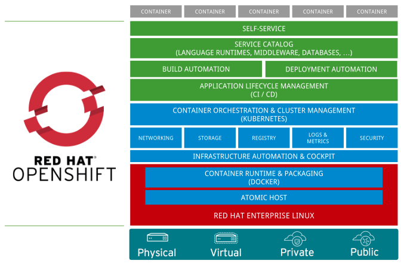

# Openshift
### Kubernetes with a human face

Vadim Rutkovsky

vrutkovs@redhat.com

---


Note:
* Enterprise Kubernetes, developer-focused
* Forked from Kubernetes codebase, regularly synced with upstream (3 month delay)
* Origin - upstream version, Openshift Container Platform - enterprise version
* OCP versions are supported for 2 years
* Additional k8s objects - ImageStream, BuildConfigs, DeploymentConfigs

---
### What's in the box?


Note:
* Base layer - your cloud provider / VMs / bare-metal
* OS with container runtime - Docker / CRI-O
* SDN / Storage / core services
* Developer services - CI/CD, Service Catalog, Web Console

---
### Openshift - batteries included
* OAuth server for authentication
* Container registry
* HAProxy router
* CI/CD out-of-the-box via Jenkins Pipelines
* Source2Image


Note:
* All things ready to get started
* Encourages CI / CD
* Devs don't require low-level Docker knowledge with S2I

---
### Getting Started

`oc` - openshift's `kubectl`

Setting up the local containerized cluster:
```shell
$ sudo oc cluster up
Starting OpenShift using openshift/origin:v3.9.0 ...
OpenShift server started.

The server is accessible via web console at:
    https://127.0.0.1:8443

You are logged in as:
    User:     developer
    Password: <any value>

To login as administrator:
    oc login -u system:admin
```

---
Install using Ansible

https://docs.openshift.org/latest/install_config/

Openshift Online

https://manage.openshift.com/

Openshift Dedicated

https://www.openshift.com/dedicated/

Cloud IDE

https://openshift.io

Note:

* openshift-ansible to install on any infrastructure
* Online to try-before-you-buy
* Dedicated - managed by Red Hat on AWS
* openshift.io to develop Java microservices online using Eclipse Che

---
# Demo
### Source 2 Image
### Builds, DeploymentConfigs
### Routes

Note:
Cluster: https://cloud.vrutkovs.eu:8443/console/

S2I demo: master branch

```shell
oc login ...
oc new-project itgm
oc new-app --name=itg-demo https://github.com/vrutkovs/openshift-demo
oc expose svc/demo --host=demo.cloud.vrutkovs.eu
```

Route: demo.cloud.vrutkovs.eu

Webhook: https://github.com/vrutkovs/openshift-demo/settings/hooks/23131808

Custom Dockerfile: custom-dockerfile branch

```
oc new-app --name=itgm-custom http://github.com/vrutkovs/openshift-demo#custom-dockerfile
oc create -f route.yaml
```
---
# Demo
### Jenkins Pipelines
### Blue - Green deployments

Note:
Namespace: pipelines

Pipelines branch: jenkins

```
oc new-project pipelines
oc new-app --name=jenkins-pipeline http://github.com/vrutkovs/openshift-demo#jenkins
```
---
# Demo
### Gitlab CI
### Blue-green deployment
### Service catalog

Note:
Namespace: blue-green

Blue-green branch: blue-green

Service Catalog: Amazon RDS
---
#### Monitoring and Metrics


Note:
Prometheus: https://prometheus.cloud.vrutkovs.eu/

Grafana: https://grafana.cloud.vrutkovs.eu/

---
### See you later, operator

**Operators** - k8s-aware application, which communicate using CRDS (custom resource definitions) and perform actions in the cluster

* **Vault Operator**

  creates and configures Hashicopr's Vault cluster

* **MySQL Operator**

  creates, scales and backs up MySQL containers in kubernetes

Note:
Cloud-native apps - the apps which are aware of running in k8s and can react to k8s events
Operators take care of running complicated apps, e.g. databases

---
#### Openshift operators
* **Openshift Metrics Server**

  scales deployments based on custom app metrics

* **Node Problem Detector**

  uses Prometheus metric to disable faulty nodes

* **Autoscaler**

  provision additional nodes
* **Chargeback**
 
  reports AWS billing, node utilization etc.

Note:
* metrics server scales your apps with demand
* problem detector finds and isolates problemtic nodes
* autoscaler adds more machines to cluster if pods don't have place to fit
* chargeback find less utilized nodes and may calculate cloud-provider bills

---


https://vrutkovs.github.io/slides-openshift-k8s-human-face/

*<!-- -->* vrutkovs  <!-- .element: class="fab fa-twitter-square" --> *<!-- -->* vrutkovs@redhat.com  <!-- .element: class="fas fa-envelope-square" -->
