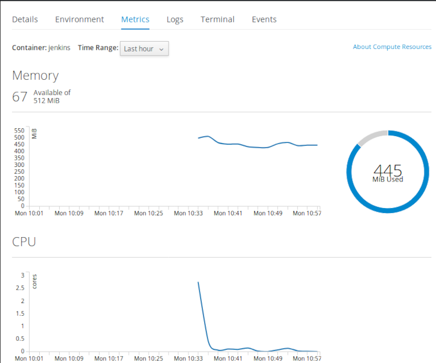
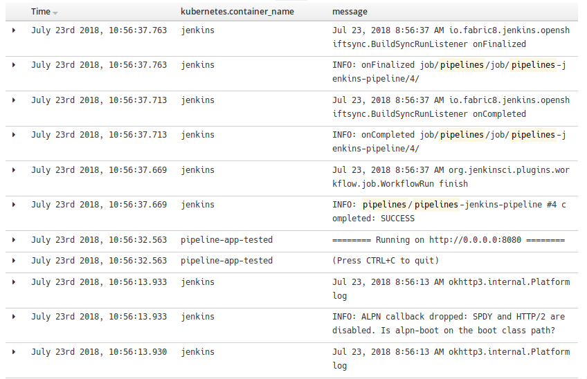

# Openshift
### Kubernetes with a human face

Vadim Rutkovsky

vrutkovs@redhat.com

---


Note:
* Heroku-style deployment - git repo -> working app
* Enterprise Kubernetes, developer-focused
* Forked from Kubernetes codebase, regularly synced with upstream (3 month delay)
* Origin - upstream version, Openshift Container Platform - enterprise version
* OCP versions are supported for 2 years
* Additional k8s objects - ImageStream, BuildConfigs, DeploymentConfigs

---
### What's in the box?


Note:
* Base layer - your cloud provider / VMs / bare-metal
* OS with container runtime - Docker / CRI-O
* SDN / Storage / core services
* Developer services - CI/CD, Service Catalog, Web Console

---
### Openshift - batteries included
* OAuth server for authentication
* HAProxy router
* Container registry
* CI/CD out-of-the-box via Jenkins Pipelines
* Source2Image


Note:
* All things ready to get started
* Encourages CI / CD
* Devs don't require low-level Docker knowledge with S2I

---
### Getting Started

`oc` - openshift's `kubectl`

Setting up the local containerized cluster:
```shell
$ sudo oc cluster up
Starting OpenShift using openshift/origin:v3.9.0 ...
OpenShift server started.

The server is accessible via web console at:
    https://127.0.0.1:8443

You are logged in as:
    User:     developer
    Password: <any value>

To login as administrator:
    oc login -u system:admin
```

---
### Builds
### Source 2 Image
### DeploymentConfigs
### Routes

---

Look mom, no Dockerfile!

```shell
$ oc login https://cloud.vrutkovs.eu -t ...
$ oc new-project beer
$ oc new-app  \
   --name=beer-demo \
   https://github.com/vrutkovs/openshift-demo
$ oc expose svc/demo --host=demo.cloud.vrutkovs.eu
```

Setup a github webhook to trigger builds on new commits

---
#### Build log
```
Cloning "https://github.com/vrutkovs/openshift-demo" ...
	Commit:	b74070426bbba32ba085846804b8b6b909880eeb (Simplify runme.sh)
	Author:	Vadim Rutkovsky <vrutkovs@redhat.com>
	Date:	Fri May 4 23:37:38 2018 +0200
--> Installing application source ...
--> Installing dependencies ...
Collecting aiohttp==2.3.10 (from -r requirements.txt (line 1))
Downloading https://files.pythonhosted.org/packages/7e/af/b2c6b5939e390e29c5a12e74a344bbc56fc866e3b68c05a7d7737e9006d7/aiohttp-2.3.10-cp36-cp36m-manylinux1_x86_64.whl  (663kB)
Collecting yarl>=1.0.0 (from aiohttp==2.3.10->-r requirements.txt (line 1))
Downloading https://files.pythonhosted.org/packages/61/67/df71b367680e06bb4127e3df6189826d4b9daebf83c3bd5b9341c99ef528/yarl-1.2.6-cp36-cp36m-manylinux1_x86_64.whl  (253kB)
...
Installing collected packages: idna, multidict, yarl, idna-ssl, chardet, async-timeout, aiohttp
Running setup.py install for idna-ssl: started
Running setup.py install for idna-ssl: finished with status 'done'
Successfully installed aiohttp-2.3.10 async-timeout-3.0.0 chardet-3.0.4 idna-2.7 idna-ssl-1.1.0 multidict-4.3.1 yarl-1.2.6

Pushing image 172.30.16.196:5000/beer/beer-demo:latest ...
Pushed 0/6 layers, 3% complete
...
Pushed 6/6 layers, 100% complete
Push successful
```
---
#### Web Console


---

Dockerfile + route settings in YAML

```shell
$ oc new-project beer-custom
$ oc new-app --name=beer-custom \
   http://github.com/vrutkovs/openshift-demo#custom-dockerfile
$ oc create -f route.yaml
```

---
### CI/CD with Jenkins Pipelines

```shell
$ oc new-project pipelines
$ oc new-app --name=jenkins-pipeline \
   http://github.com/vrutkovs/openshift-demo#jenkins
```

---
```groovy
stage("Build") {
    openshiftBuild
      buildConfig: "pipeline-app", showBuildLogs: "true"
}

stage("Deploy to dev") {
    openshiftDeploy deploymentConfig: "pipeline-app"
}

stage("Smoketest") {
  sh "curl -kLvs
      http://pipeline-app.pipelines.svc:8080/Minsk |
      grep 'Hello, Minsk'"
}

stage("Deploy to tested") {
  openshiftTag
    srcStream: "pipeline-app", srcTag: 'latest',
    destinationStream: "pipeline-app",
    destinationTag: "smoketested"
  openshiftDeploy deploymentConfig: "pipeline-app-tested"
}
```
---


---
#### Jenkins Pipeline view


Note:

Mention Gitlab CI - use `oc` CLI

---
#### Monitoring and Metrics


---



---
#### ELK stack to store container logs


---
#### Prometheus + Grafana stack for metrics


---
### See you later, operator

**Operators** - k8s-aware application, which communicate using CRDS (custom resource definitions) and perform actions in the cluster

* **Vault Operator**

  creates and configures Hashicorp's Vault cluster

* **MySQL Operator**

  creates, scales and backs up MySQL containers in kubernetes

Note:
Cloud-native apps - the apps which are aware of running in k8s and can react to k8s events
Operators take care of running complicated apps, e.g. databases

---
#### Openshift operators
* **Openshift Metrics Server**

  scales deployments based on custom app metrics

* **Node Problem Detector**

  uses Prometheus metric to disable faulty nodes

* **Autoscaler**

  provision additional nodes
* **Chargeback**

  reports AWS billing, node utilization etc.

Note:
* metrics server scales your apps with demand
* problem detector finds and isolates problemtic nodes
* autoscaler adds more machines to cluster if pods don't have place to fit
* chargeback find less utilized nodes and may calculate cloud-provider bills

---
Install using Ansible

https://docs.openshift.org/latest/install_config/

Openshift Online

https://manage.openshift.com/

Openshift Dedicated

https://www.openshift.com/dedicated/

Cloud IDE w/ Eclipse Che

https://openshift.io

Note:

* openshift-ansible to install on any infrastructure
* Online to try-before-you-buy
* Dedicated - managed by Red Hat on AWS
* openshift.io to develop Java microservices online using Eclipse Che
---


https://vrutkovs.github.io/slides-openshift-k8s-human-face/

*<!-- -->* vrutkovs  <!-- .element: class="fab fa-twitter-square" --> *<!-- -->* vrutkovs@redhat.com  <!-- .element: class="fas fa-envelope-square" -->
