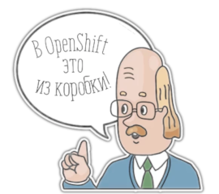

# Openshift
### Kubernetes with a human face
Vadim Rutkovsky
##### vrutkovs@redhat.com

---


Note:
* Enterprise Kubernetes, developer-focused
* Additional k8s objects - ImageStream, BuildConfigs, DeploymentConfigs
* Heroku-style deployment - git repo -> working app
* Operator-based distribution
* OKD - community-supported version, Openshift Container Platform - enterprise version

---
### Openshift - batteries included
- Internal OAuth server for authentication
- Internal container registry
- ImageStreams + BuildConfigs + DeploymentConfigs
- CI/CD via Jenkins Pipelines



Note:
* All things ready to get started
* Encourages CI / CD
* Devs don't require low-level Docker knowledge with S2I

---
### DevOps 101

```python
10 git commit
20 git push
30 ??? some ops magic ???
40 GOTO 10
```

---
#### Look mom, no Dockerfile!


Setup a github webhook to trigger builds on new commits

---
##### Build log
```
Cloning "https://github.com/vrutkovs/openshift-demo" ...
	Commit:	b74070426bbba32ba085846804b8b6b909880eeb (Simplify runme.sh)
	Author:	Vadim Rutkovsky <vrutkovs@redhat.com>
	Date:	Fri May 4 23:37:38 2018 +0200
--> Installing application source ...
--> Installing dependencies ...
Collecting aiohttp==2.3.10 (from -r requirements.txt (line 1))
Downloading https://files.pythonhosted.org/packages/7e/af/b2c6b5939e390e29c5a12e74a344bbc56fc866e3b68c05a7d7737e9006d7/aiohttp-2.3.10-cp36-cp36m-manylinux1_x86_64.whl  (663kB)
Collecting yarl>=1.0.0 (from aiohttp==2.3.10->-r requirements.txt (line 1))
Downloading https://files.pythonhosted.org/packages/61/67/df71b367680e06bb4127e3df6189826d4b9daebf83c3bd5b9341c99ef528/yarl-1.2.6-cp36-cp36m-manylinux1_x86_64.whl  (253kB)
...
Installing collected packages: idna, multidict, yarl, idna-ssl, chardet, async-timeout, aiohttp
Running setup.py install for idna-ssl: started
Running setup.py install for idna-ssl: finished with status 'done'
Successfully installed aiohttp-2.3.10 async-timeout-3.0.0 chardet-3.0.4 idna-2.7 idna-ssl-1.1.0 multidict-4.3.1 yarl-1.2.6

Pushing image 172.30.16.196:5000/lvee/lvee-demo:latest ...
Pushed 0/6 layers, 3% complete
...
Pushed 6/6 layers, 100% complete
Push successful
```
---
#### Web Console


---

#### Dockerfile + route settings in YAML


---
#### CI/CD with Jenkins Pipelines


---
```groovy
stage("Build") {
  openshiftBuild
    buildConfig: "pipeline-app", showBuildLogs: "true"
}

stage("Deploy to dev") {
  openshiftDeploy deploymentConfig: "pipeline-app"
}

stage("Smoketest") {
  sh "curl -kLvs
      http://pipeline-app.pipelines.svc:8080/Minsk |
      grep 'Hello, Minsk'"
}

stage("Deploy to tested") {
  openshiftTag
    srcStream: "pipeline-app", srcTag: 'latest',
    destinationStream: "pipeline-app",
    destinationTag: "smoketested"
  openshiftDeploy deploymentConfig: "pipeline-app-tested"
}
```
---


---
#### Jenkins Pipeline view


Note:

Mention Gitlab CI - use `oc` CLI

---
#### Monitoring and Metrics


Note:

TODO: Show alerts in the webconsole

---
### Prometheus + Grafana


---
### See you later, operator

**Operators** - k8s-aware application, which communicate using CRDs (custom resource definitions) and perform actions in the cluster

Examples:

<!-- .element: class="fragment" data-fragment-index="1" -->**Prometheus Operator** maintains and configures Prometheus cluster

<!-- .element: class="fragment" data-fragment-index="2" -->**Vitesse Operator** creates, scales and backs up MySQL containers in kubernetes

Note:
Cloud-native apps - the apps which are aware of running in k8s and can react to k8s events
Operators take care of running complicated apps, e.g. databases

---
### Where Do I Find Operators?

https://operatorhub.io

<!-- .element: class="fragment" data-fragment-index="1" -->**Operator Lifecycle Manager** takes care of operator provisioning, update and configuration


---
### OpenShift-specific operator - MachineConfig

**MachineConfig** - custom object, which contains a list of encoded files and systemd units

<!-- .element: class="fragment" data-fragment-index="1" --> MachineConfigs are assembled into **MachineConfigPool**s, assigned to a node group

<!-- .element: class="fragment" data-fragment-index="2" --> **MachineConfigOperator** runs a daemon on the hosts and synchronises files and systemd unit state with the k8s object specification

---
### OpenShift-specific operator - Machine API

When running in the known cloud Machine API Operator can provision additional nodes

<!-- .element: class="fragment" data-fragment-index="1" --> Additional entities - **Machine** and **MachineSet** - is introduced to keep the info about desired node configs and quantity

<!-- .element: class="fragment" data-fragment-index="2" --> MachineSet can be scaled, creating a new Machine instance. A new Machine joins the cluster via TLS bootstrapping
---
### Operator benefits

*<!-- .element: class="fragment" data-fragment-index="1" --> One image to rule them all

*<!-- .element: class="fragment" data-fragment-index="2" --> Cluster config = sum of operator configs (GitOps)

*<!-- .element: class="fragment" data-fragment-index="3" --> Operator status -> cluster health status

*<!-- .element: class="fragment" data-fragment-index="4" --> Upgrading a cluster is essentially updating every operator

---
### Operated Operating System
RHEL CoreOS is RHEL8, designed to run containers only. Community counterpart - **Fedora CoreOS**


RHEL CoreOS release cycle is bound to OpenShift, not RHEL

<!-- .element: class="fragment" data-fragment-index="1" -->**RHEL Core OS** = ContainerLinux ideas + RHEL packages

---
### RHEL CoreOS specifics

<!-- .element: class="fragment" data-fragment-index="1" -->**Ignition** to declaratively configure the system

<!-- .element: class="fragment" data-fragment-index="2" -->**ostree** to make use of read-only root and atomic transactions

<!-- .element: class="fragment" data-fragment-index="3" -->**MachineConfigDaemon** to apply updates and custom configs to existing instances

---
### Give it a try

https://try.openshift.com

Openshift Online

https://manage.openshift.com/

Code Ready Containers - local OpenShift4

https://code-ready.github.io/crc/

Note:

* Online to try-before-you-buy
* Dedicated - managed by Red Hat on AWS
* openshift.io to develop Java microservices online using Eclipse Che
---


Slides - https://vrutkovs.github.io/slides-openshift-k8s-human-face/

Contacts - https://vrutkovs.eu
