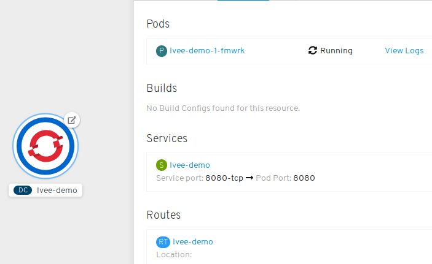

# Openshift
### Kubernetes with a human face
Vadim Rutkovsky
##### vrutkovs@redhat.com

---


Note:
* Heroku-style deployment - git repo -> working app
* Enterprise Kubernetes, developer-focused
* Operator-based distribution
* OKD - community-supported version, Openshift Container Platform - enterprise version
* Additional k8s objects - ImageStream, BuildConfigs, DeploymentConfigs

---
### What's in the box?


---
### DevOps 101

```python
10 git commit
20 git push
30 some ops magic
40 Ask manager for a raise
50 GOTO 10
```
---
### Openshift - batteries included
- Internal OAuth server for authentication
- HAProxy router
- Container registry
- CI/CD via Jenkins Pipelines
- Source2Image


Note:
* All things ready to get started
* Encourages CI / CD
* Devs don't require low-level Docker knowledge with S2I

---
### Kubernetes++
#### Source 2 Image
#### Builds
#### DeploymentConfigs
#### Routes

---

Look mom, no Dockerfile!


Setup a github webhook to trigger builds on new commits

---
#### Build log
```
Cloning "https://github.com/vrutkovs/openshift-demo" ...
	Commit:	b74070426bbba32ba085846804b8b6b909880eeb (Simplify runme.sh)
	Author:	Vadim Rutkovsky <vrutkovs@redhat.com>
	Date:	Fri May 4 23:37:38 2018 +0200
--> Installing application source ...
--> Installing dependencies ...
Collecting aiohttp==2.3.10 (from -r requirements.txt (line 1))
Downloading https://files.pythonhosted.org/packages/7e/af/b2c6b5939e390e29c5a12e74a344bbc56fc866e3b68c05a7d7737e9006d7/aiohttp-2.3.10-cp36-cp36m-manylinux1_x86_64.whl  (663kB)
Collecting yarl>=1.0.0 (from aiohttp==2.3.10->-r requirements.txt (line 1))
Downloading https://files.pythonhosted.org/packages/61/67/df71b367680e06bb4127e3df6189826d4b9daebf83c3bd5b9341c99ef528/yarl-1.2.6-cp36-cp36m-manylinux1_x86_64.whl  (253kB)
...
Installing collected packages: idna, multidict, yarl, idna-ssl, chardet, async-timeout, aiohttp
Running setup.py install for idna-ssl: started
Running setup.py install for idna-ssl: finished with status 'done'
Successfully installed aiohttp-2.3.10 async-timeout-3.0.0 chardet-3.0.4 idna-2.7 idna-ssl-1.1.0 multidict-4.3.1 yarl-1.2.6

Pushing image 172.30.16.196:5000/lvee/lvee-demo:latest ...
Pushed 0/6 layers, 3% complete
...
Pushed 6/6 layers, 100% complete
Push successful
```
---
#### Web Console


---

Dockerfile + route settings in YAML


---
### CI/CD with Jenkins Pipelines


---
```groovy
stage("Build") {
    openshiftBuild
      buildConfig: "pipeline-app", showBuildLogs: "true"
}

stage("Deploy to dev") {
    openshiftDeploy deploymentConfig: "pipeline-app"
}

stage("Smoketest") {
  sh "curl -kLvs
      http://pipeline-app.pipelines.svc:8080/Minsk |
      grep 'Hello, Minsk'"
}

stage("Deploy to tested") {
  openshiftTag
    srcStream: "pipeline-app", srcTag: 'latest',
    destinationStream: "pipeline-app",
    destinationTag: "smoketested"
  openshiftDeploy deploymentConfig: "pipeline-app-tested"
}
```
---


---
#### Jenkins Pipeline view


Note:

Mention Gitlab CI - use `oc` CLI

---
#### Monitoring and Metrics


Note:

TODO: Show alerts in the webconsole

---
### Prometheus + Grafana stack for metrics


---
### See you later, operator

**Operators** - k8s-aware application, which communicate using CRDs (custom resource definitions) and perform actions in the cluster

Examples:
- **Vault Operator** creates and configures Hashicorp's Vault cluster

- **MySQL Operator** creates, scales and backs up MySQL containers in kubernetes

Note:
Cloud-native apps - the apps which are aware of running in k8s and can react to k8s events
Operators take care of running complicated apps, e.g. databases

---
### MachineConfig operator

**MachineConfig** - custom object, which contains a list of encoded files and systemd units

<!-- .element: class="fragment" data-fragment-index="1" --> MachineConfigs are assembled into **MachineConfigSet**s, assigned to a node group

<!-- .element: class="fragment" data-fragment-index="2" --> **MachineConfigOperator** runs a daemon on the hosts and synchronises files and systemd unit state with the k8s object specification

---
### Machine API

When running in the known cloud Machine API Operator can provision additional nodes

<!-- .element: class="fragment" data-fragment-index="1" --> Additional entities - **Machine** and **MachineSet** - is introduced to keep the info about desired node configs and quantity

<!-- .element: class="fragment" data-fragment-index="2" --> MachineSet can be scaled, additional Machines are created via cloud API. The Machine gets provisioned by MachineConfigOperator and joins the cluster as a node

---
### Operated Operating System

<!-- .element: class="fragment" data-fragment-index="2" -->RHEL Core OS = ContainerLinux ideas + RHEL packages
<!-- .element: class="fragment" data-fragment-index="2" -->**Ignition** to declaratively configure the system,
  **ostree** to make use of read-only root and atomic transactions,
  **MachineConfigOperator** to control the node via cluster

---
### Red Hat CoreOS
RHCOS is RHEL8, designed to run as OpenShift node. Community counterpart - **Fedora CoreOS**


RHCOS release cycle is bound to OpenShift, not RHEL

---
### Operator benefits

*<!-- .element: class="fragment" data-fragment-index="1" --> Install payload - an image with references to ~25 operators

*<!-- .element: class="fragment" data-fragment-index="4" --> Cluster config = sum of operator configs (GitOps)

*<!-- .element: class="fragment" data-fragment-index="2" --> Upgrading a cluster is essentially updating all the operators

*<!-- .element: class="fragment" data-fragment-index="3" --> Operator sum up component's status

---
### Give it a try

https://try.openshift.com

Openshift Online

https://manage.openshift.com/

Openshift Dedicated

https://www.openshift.com/dedicated/

Note:

* Online to try-before-you-buy
* Dedicated - managed by Red Hat on AWS
* openshift.io to develop Java microservices online using Eclipse Che
---


https://vrutkovs.github.io/slides-openshift-k8s-human-face/

https://vrutkovs.eu
